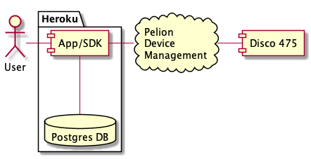
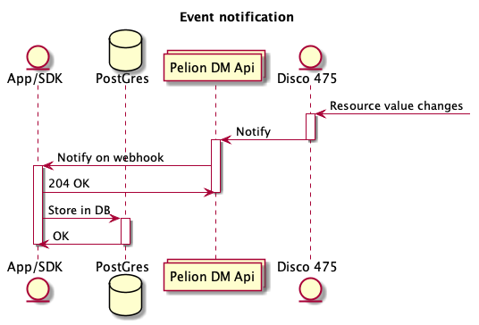
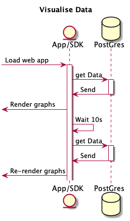

## App Architecture

This app consists of

- barebones express.js web server
- react.js app
- postgres database
- [Pelion Device Management JavaScript SDK](//github.com/ARMmbed/mbed-cloud-sdk-javascript)

## App startup

At startup this app will initialise the db table and setup the webhook channel with Pelion Device management. The app will start a request for subscriptions to device resources.

## Device resource changes

When the resource value on a device changes, the notification channel is updated with this information and the web app stores each notification in the postgres database

## Visualising Data

The included react app requests all data from the server and visualises this using the recharts library

